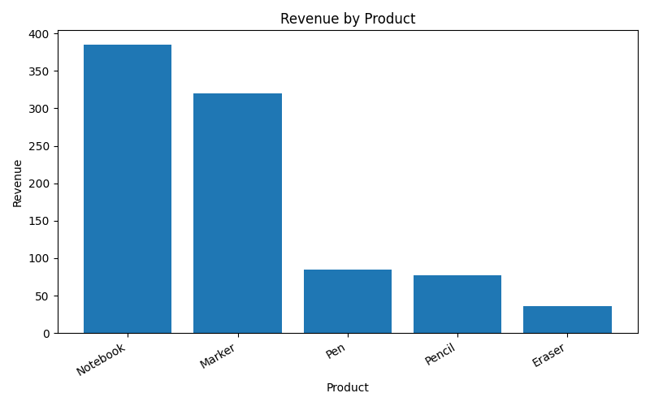

# Task 7 --- Basic Sales Summary using SQLite and Python

## 🎯 Objective

To create a small SQLite database, run SQL queries from Python, and
visualize sales data using pandas and matplotlib.

------------------------------------------------------------------------

## 🛠 Tools & Libraries Used

-   Python (3.x)\
-   SQLite (`sqlite3` module)\
-   Pandas\
-   Matplotlib

------------------------------------------------------------------------

## 📌 Steps Performed

1.  **Created a SQLite database (`sales_data.db`)** with a `sales` table
    containing product sales data.\
2.  **Connected Python to the database** using
    `sqlite3.connect("sales_data.db")`.\
3.  **Executed SQL query** to calculate:
    -   Total quantity sold\
    -   Total revenue per product\
4.  **Loaded query results into Pandas DataFrame** with
    `pd.read_sql_query()`.\
5.  **Displayed results** using `print(df)`.\
6.  **Plotted a bar chart** of revenue by product using matplotlib.\
7.  **Saved output** as `sales_chart.png` and exported results to
    `sales_summary.csv`.

------------------------------------------------------------------------

## 📊 SQL Query Used

``` sql
SELECT 
    product, 
    SUM(quantity) AS total_qty, 
    SUM(quantity * price) AS revenue
FROM sales
GROUP BY product
ORDER BY revenue DESC;
```

------------------------------------------------------------------------

## 📂 Deliverables

-   `task7_sales_summary.py` → Python script\
-   `sales_data.db` → SQLite database\
-   `sales_chart.png` → Bar chart of revenue by product\
-   `sales_summary.csv` → Exported query results (optional)\
-   `README.md` → Documentation

------------------------------------------------------------------------

## 📸 Output

**Printed Sales Summary (sample):**

        product   total_qty   revenue
    0   Notebook          8     385.0
    1     Marker         12     320.0
    2        Pen         17      85.0
    3     Pencil         35      77.5
    4     Eraser         12      36.0

**Bar Chart (Revenue by Product):**\


------------------------------------------------------------------------

## 📖 Learning Outcome

-   Learned to connect Python with SQLite database.\
-   Executed SQL queries within Python using `sqlite3`.\
-   Performed data aggregation with `GROUP BY`.\
-   Visualized results with matplotlib bar chart.\
-   Understood how SQL + Python + Pandas + Matplotlib work together for
    data analysis.
a

✅ This completes **Task 7 -- Basic Sales Summary using SQLite and
Python**.
